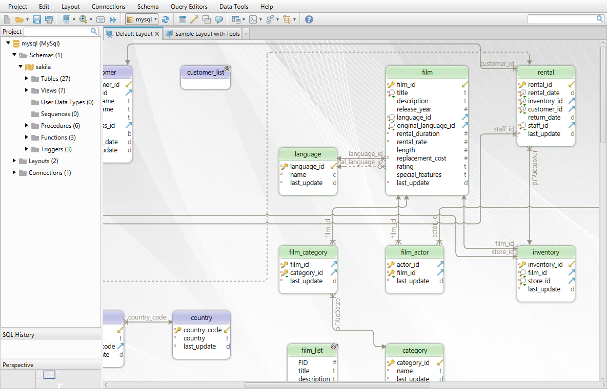
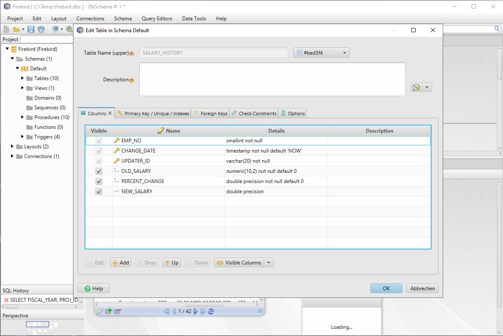
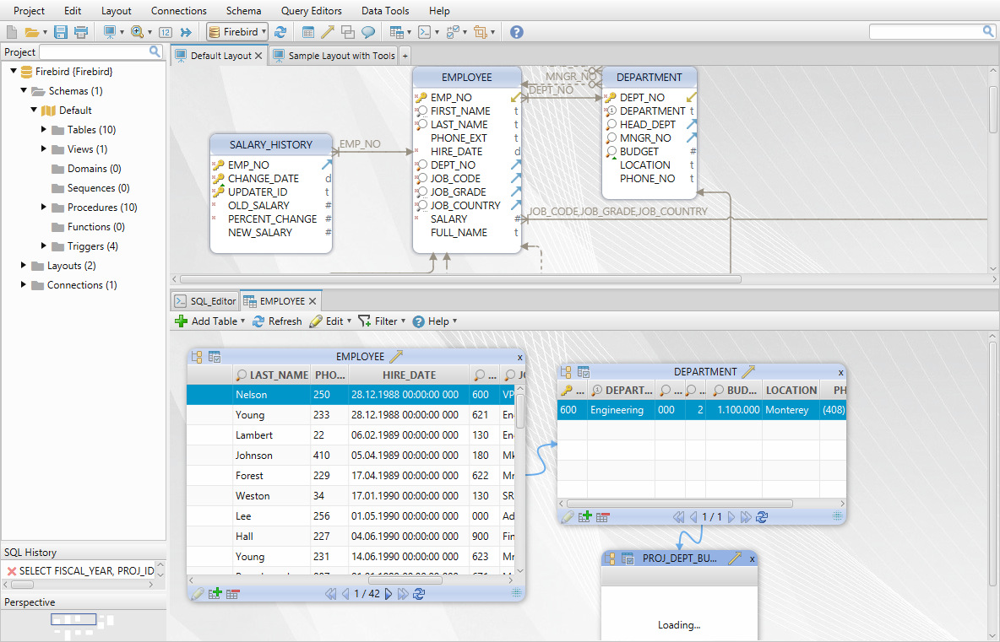
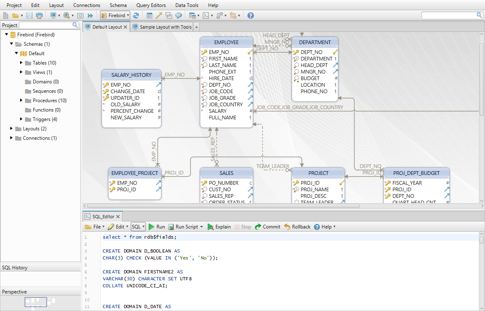

# DbSchema: Visual Database Diagram Designer & Admin GUI Tool
#### Intuitive, Beautiful, Friendly

> Simplify database design & management. Edit, document and browse complex databases with a friendly GUI tool.
> DbSchema supports: PostgreSQL, MSSql, MySQL, RedShift, MariaDB, Redshift, Cassandra, MongoDb, Db2, Sybase ...

This repository is currently being used for hosting the official issue & bug tracker of DbSchema.

Download: [DbSchema Website](https://dbschema.com)
 
Report bugs/request new feature: [issues](https://github.com/wise-coders/dbschema/issues).

Author: Wise Coders GmbH

DbSchema screenshots:

Edit table in the database

Relational data browse for easy exploring database data

SQL Editor with text auto-completion

or dark theme

DbSchema has 15 days trial time.

Full information on [DbSchema Website](https://dbschema.com). 

DbSchema team.